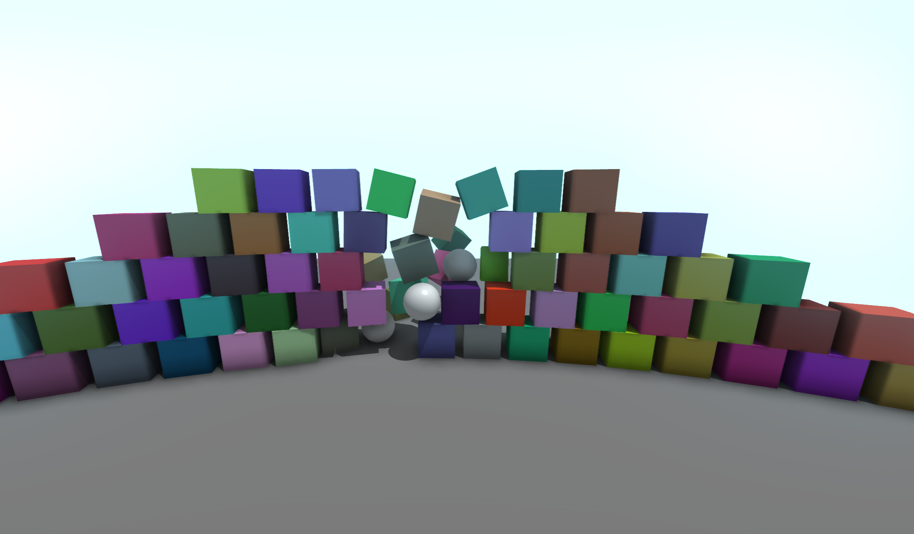
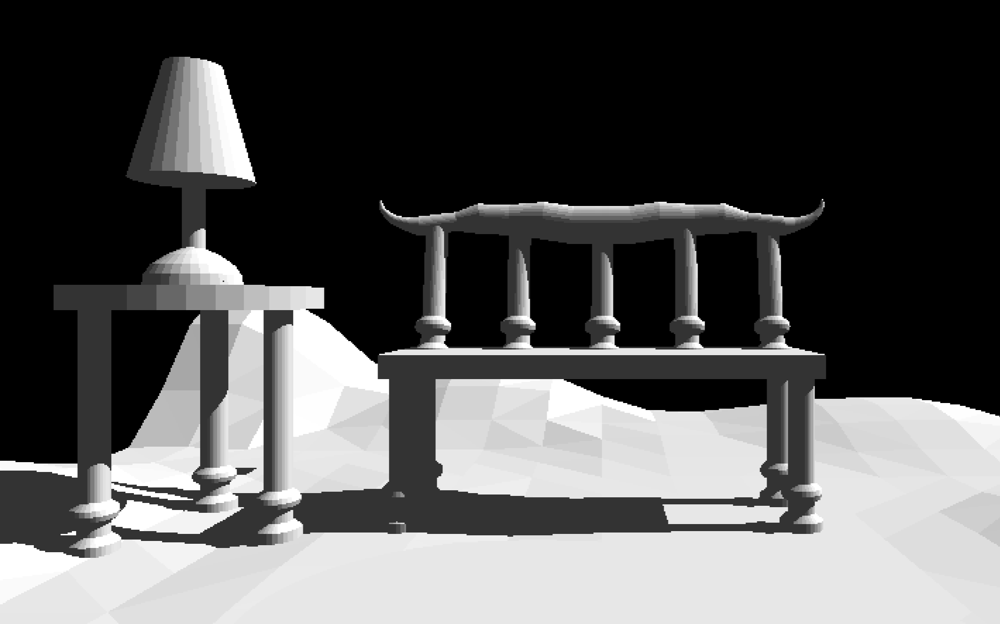

# Hengine
The Hengine is a JavaScript game engine for both small scale creative coding projects and larger scale games. It can be loaded in both a 2D and 3D mode, to create games with different dimensionality. It has a high-performance WebAssembly physics engine, compute shader support (without WebGPU!), and a robust library of geometric classes and algorithms. See [Usage](#usage) to create your first Hengine program in just 3 lines of HTML, and learn the rest from the [documentation](https://elkwizard.github.io/Hengine/Docs/Generated) and [examples](#examples)!



## Installation (Optional)
The Hengine doesn't need to be installed. However, if you want to run code with a local copy of the Hengine (to preserve compatibility), simply clone this repository.

```bash
git clone "https://www.github.com/Elkwizard/Hengine.git"
```

## Usage
Before using the Hengine, it must be included in your HTML file in one of two possible ways.

1. Including a script tag pointing to `Hengine/Package/Engine/Manage/HengineLoader.js`, and linking to an external main JavaScript file. If you want to load the engine in 3D Mode, add the query parameter `?3d` to the end of the URL.

    ```html
    app.html:

    <html>
        <head>
            <script src="https://elkwizard.github.io/Hengine/Package/Engine/Manage/HengineLoader.js"></script>
        </head>
        <body>
            <script>
                // Load Hengine, user's main JavaScript file is index.js in this example.
                HengineLoader.load([
                    new HengineScriptResource("index.js")
                ]);
            </script>
        </body>
    </html>
    ```
    ```js
    index.js:

    // Hengine hello world
    ui.textMode = TextMode.CENTER_CENTER; // Text will be drawn relative to its center

    intervals.continuous(() => {
        ui.draw(Color.BLACK).text(Font.Arial50, "Hello World!", middle); // Draw "Hello World" to the middle of the screen
    });
    ```

2. Including a script tag pointing to `Hengine/Hengine.js` with the main JavaScript code embedded within. Similar to the previous approach, appending `?3d` to the URL will load the engine in 3D Mode.

    ```html
    compactApp.html:

    <script src="https://elkwizard.github.io/Hengine/Hengine.js">
        // Hengine hello world
        ui.textMode = TextMode.CENTER_CENTER; // Text will be drawn relative to its center

        intervals.continuous(() => {
            ui.draw(Color.BLACK).text(Font.Arial50, "Hello World!", middle); // Draw "Hello World" to the middle of the screen
        });
    </script>
    ```

## Examples
1. [Hello World Demo](https://elkwizard.github.io/Hengine/Demos/HelloWorld.html)
2. [2D Physics Demo](https://elkwizard.github.io/Hengine/Demos/Physics2D.html)
2. [3D Physics Demo](https://elkwizard.github.io/Hengine/Demos/Physics3D.html)
3. [Shader Demo](https://elkwizard.github.io/Hengine/Demos/Shader.html)

## Gallery




## Documentation

The documentation for the Hengine can be found [here](https://elkwizard.github.io/Hengine/Docs/Generated/index.html).